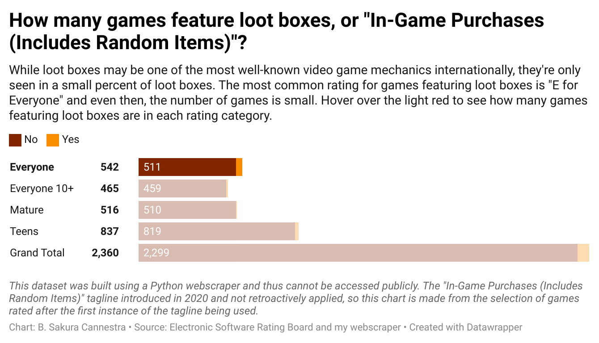
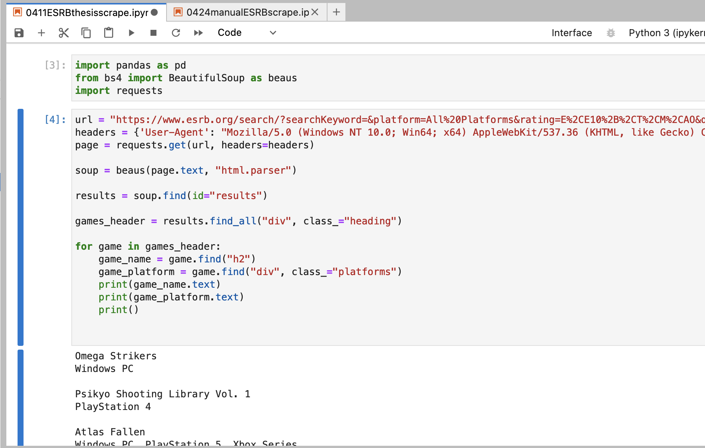
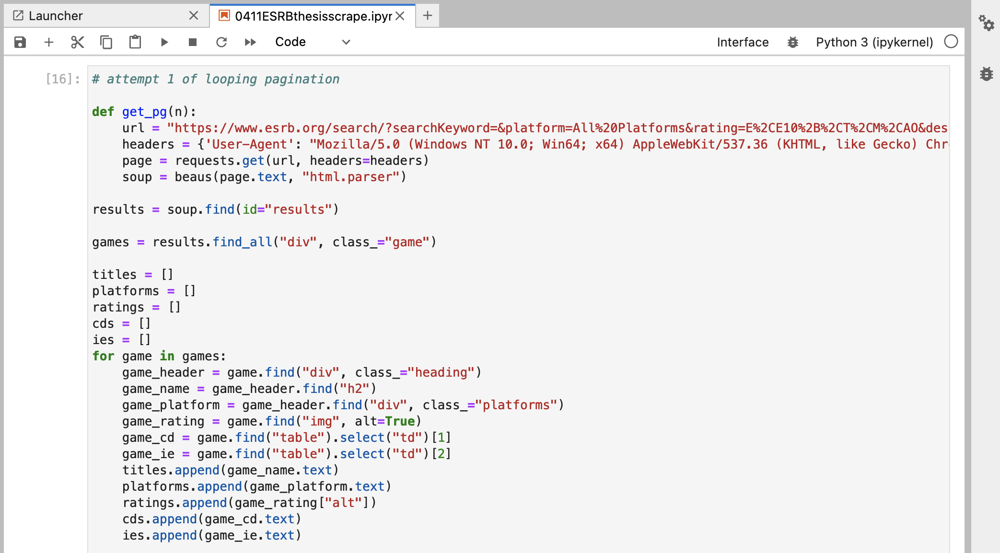
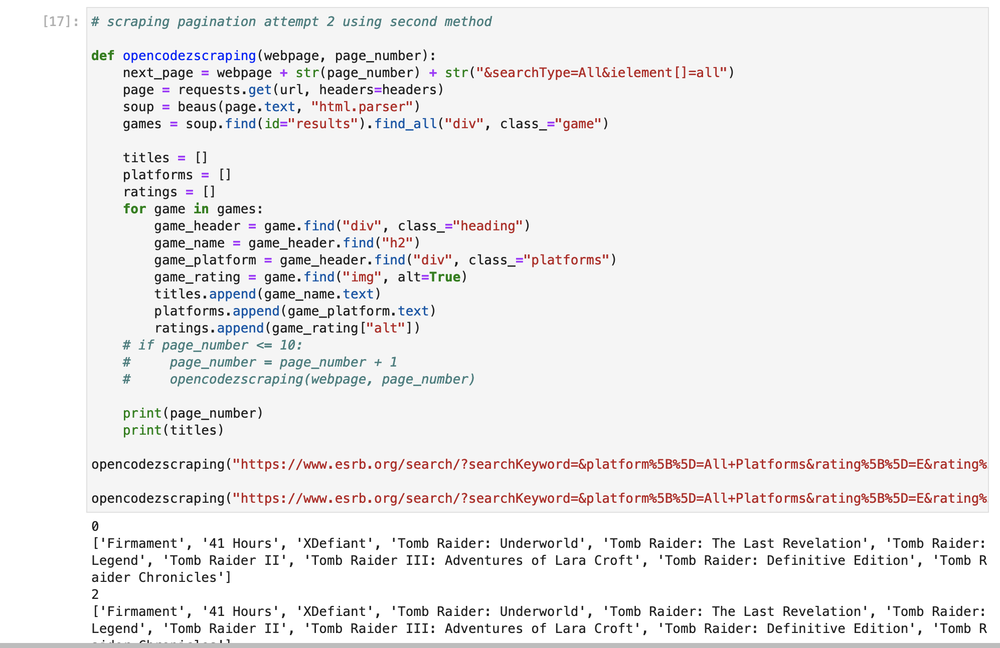
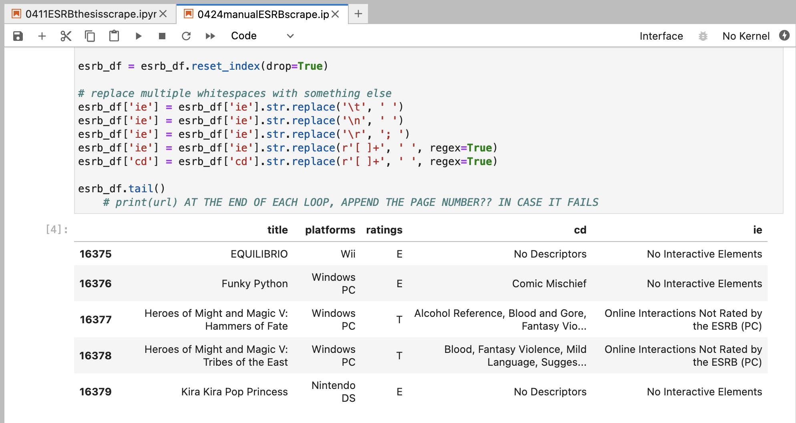
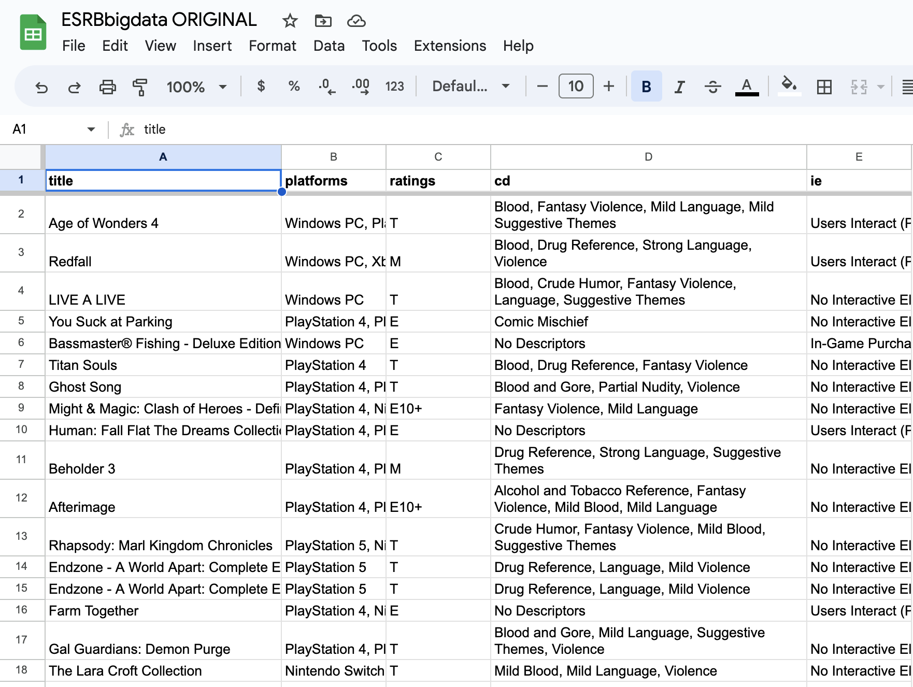
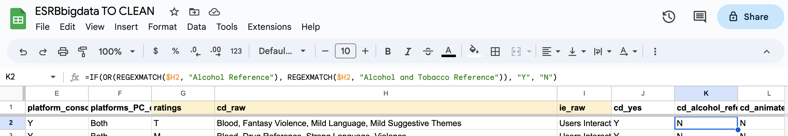
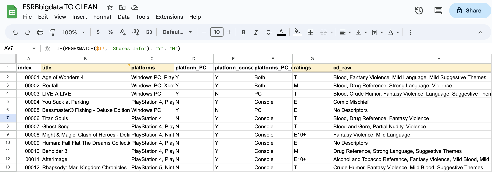

# J296 Final Project: Scraping the Electronic Software Rating Board's public game rating database

By B. Sakura Cannestra

## Gaming the Rating: Gambling and monetization in video games

One of the most notorious and scrutinized video game mechanics is featured in less than 3 percent of the console and computer gaming market.

This mechanic — loot boxes — is a form of in-game purchase where a player spends either real-world money or in-game currency to buy an in-game box, containing a random item or set of items. This mechanic grew in notoriety in 2018, when researchers found a psychological link between problem gambling and spending on loot boxes, as well as the release of Entertainment Arts’ Star Wars: Battlefront II, which featured a loot box mechanic that many considered “pay-to-win.” 

Many nations around the world have considered regulating games that feature loot boxes. Most recently in March, [the Australian federal government announced]( https://www.gamesindustry.biz/australia-proposes-labeling-games-with-loot-boxes-m-for-15-and-over) plans to rate all games containing simulated gambling for players over 18, and any game containing loot boxes for players over 15.

In the United States, the only self-regulatory body for the video game industry is the Electronic Rating Software Board, or ESRB. The ESRB provides video game ratings for parents and consumers, along with information the game’s contents. Most platform holders, such as Sony, Nintendo and Microsoft, require games to be rated by the ESRB before they can be playable on their consoles.

The ESRB currently has three descriptors related to gambling — “Simulated Gambling”, “Gambling Themes” and “Real Gambling.” There are 403 games featuring the “Simulated Gambling” descriptor and the amount of gambling present in each game varies. In “Stardew Valley,” there is a casino location where players can wager digital coins in slot machines and card games. In “Poker Club,” gameplay centers around simulated poker games and tournaments.

Only 403 of the 32,445 games rated by the ESRB as of May 2, 2023, have the “Simulated Gambling” descriptor. Of those 403, over half are rated “T for Teens”.

!(Bar graph of the five ESRB rating categories, showing how many video games do and do not have the "Simulated Gambling" descriptor. The rating with the most games featuring this descriptor is "T for Teens," with 216 games having the descriptor and 6, 886 games without the descriptor.)[/img/how-many-video-games-feature-simulated-gambling-.png]
[Link to Datawrapper](https://datawrapper.dwcdn.net/KAlas/3/)

Games with "Simulated Gambling" are also slightly more common on PC than console, with 185 PC-only games bearing the descriptor compared to 157 console-only games. 30 games with the descriptor are playable on both PC and console. 

!(Bar chart denoting the prevalence of games with the "Simulated Gambling" descriptor on these platforms: "PC", "Console", "Other", and "Both". While the total number of games with this descriptor is small, it's significant to see how the "Simulated Gambling" descriptor is utilized.)[./img/what-console-are-simulated-gambling-games-playable.png]
[Link to Datawrapper](https://datawrapper.dwcdn.net/IF8oe/1/)

According to ESRB spokesperson Max Jay, if a game garnered the “Real Gambling” descriptor, it would be automatically rated “Adults Only,” as this descriptor denotes games that use real-world money for gambling. However, there are currently no games listed on the ESRB’s online ratings search using the “Real Gambling” content description.

“A Real Gambling Content Descriptor assignment would require a game to include casino games, as well as the ability to wager real cash or currency,” Jay said in an email. “Real Gambling is likely not assigned to physical video games because submitted games have not met the criteria.”

There are also no games listed with the “Gambling Themes” descriptor, but Jay noted that this content description is “very new” and likely has not been assigned to a physical game yet. 

While content descriptors are weighed when rating a game, the Interactive Elements are not.
 
A game’s Interactive Elements are features of the game beyond its content, such as possible microtransactions or interacting with other users. In 2018, the ESRB introduced the “In-Game Purchases” interactive element tagline and [introduced the “In-Game Purchases (Includes Random Items)”](https://www.esrb.org/blog/in-game-purchases-includes-random-items/) tagline in 2020 to identify games with loot box mechanics. These taglines were not applied retroactively, however, so many games that featured loot box mechanics but were published before 2020 did not received the tagline. 

As such, only 2,306 video games have been rated since the first instance of a game being given the label. Out of these games, 61 have warranted the “In-Game Purchases (Includes Random Items)” interactive elements tagline. This is consistent with data IT University of Copenhagen Ph.D. fellow Leon Y. Xiao has found, with about 2 to 3 percent of console and PC games featuring loot box elements. Xiao’s research centers on international applications for regulating loot boxes.

[Link to Datawrapper](https://datawrapper.dwcdn.net/1AibX/1/)

Despite the slim representation in video games, there are a few reasons why loot boxes are one of the most scrutinized mechanics in the industry. Xiao suggested that these mechanics may be more prominent on the mobile platform, as opposed to console and PC. The ESRB does not provide ratings for mobile games.

“I think this inconsistency is interesting,” Xiao said. “That, even though on the console market, only this few percentage of games have these loot boxes, but then, at the same time,…everyone is talking about them. So this seems to only suggests to me that these few games are actually very important, and they must be making a lot of money, perhaps disproportionately, amount of money as compared to the other games.”

## Dear Data Diary

### Questions I want answered 

1. How many video games are labeled with gambling-related content descriptors ("Simulated Gambling", "Real Gambling", and "Gambling Themes)?
2. What are the ratings for video games with these descriptors, and what kinds of video games are these? How prevalent is the gambling for each descriptor? 
3. Are the gambling-related descriptors connected at all to the game's monetization strategy? Especially if it employs loot boxes, tagged as "In-Game Purchase (Includes Random Items)" in the ESRB's system.
4. How many games have the "In-Game Purchase (Includes Random Items)" interactive element tagline, and how does that compare to the more general "In-Game Purchase"?
5. Is the number or proportion of "In-Game Purchase (Includes Random Items)" games significant?

### 1. Sources

* Leon Y. Xiao 
    * leon.xiao.y@gmail.com

Leon is a PhD fellow at IT University of Cophenhagen. He has been researching the application and feasibility of various regulations for loot boxes and loot box mechanics, from ESRB self regulation to the UK's recent decision to not regulate loot boxes as a form of gambling to Belgium's blanket ban.  

* Max Jay
    * mjay@esrb.org

Max is the associate director for communications at the Electronic Software Rating Board, or ESRB, which is a video game industry self-regulatory board that provides video game ratings for parents and consumers. 

I also used various online sources including the ESRB website, past reporting on Australia's proposed loot box regulation and the ESRB's adoption of "In-Game Purchases" and "In-Game Purchases (Includes Random Items)". 

### 2. Gathering the data

No dataset like this existed publicly when I first began looking into this data. Two years ago, someone on Kaggle had created [a dataset of game ratings and content descriptors](https://www.kaggle.com/datasets/imohtn/video-games-rating-by-esrb) but this dataset had a few problems for my needs. For starters, two years worth in video game releases is a lot of data to be missing, and I wanted my dataset to be as up-to-date and inclusive as possible. The dataset I eventually used has 32,445 games, whereas the Kaggle dataset has 1,895 games. Now that I actually write out those numbers, it's very, very obvious that the Kaggle dataset isn't includive of all video games the ESRB has rated. 

A more nuanced issue with this dataset is that the "In-Game Purchases (Includes Random Items)" Interactive Element tagline only entered the ESRB's use in April 2020, [as per this press release](https://www.esrb.org/blog/in-game-purchases-includes-random-items/). A much larger problem is that, to my knowledge and according to the Kaggle description, there are no Interactive Elements in this dataset. It only accounts for content descriptors. 

This means I'll have to make my own dataset.

This is a list of the information I was hoping to get:
* Game Title
* Rating
* Platform(s)
* Content Descriptor(s)
    * Alcohol Reference
    * Animated Blood
    * Blood
    * Blood and Gore
    * Comic Mischief
    * Crude Humor
    * Drug Reference
    * Fantasy Violence
    * Gambling Themes
    * Intense Violence
    * Language
    * Lyrics
    * Mature Humor
    * Nudity
    * Partial Nudity
    * Real Gambling
    * Sexual Content
    * Sexual Themes
    * Sexual Violence
    * Simulated Gambling
    * Strong Language
    * Strong Lyrics
    * Strong Sexual Content
    * Suggestive Themes
    * Tobacco Reference
    * Use of Alcohol
    * Use of Drugs
    * Use of Tobacco
    * Violence
    * Violent Reference
* Interactive Element(s)
    * In-Game Purchases
    * In-Game Purchases (Includes Random Items)
    * Users Interact
    * Shares Location
    * Shares Info

#### 2.1 Brute forcing with Google Sheets

I started on the below Google Sheet, where I used the function "=IMPORTXML()" to pull game titles, ratings, platforms, content descriptions and interactive elements. I have not updated this since early April, which is why the `title_perma` column is different from the titles importing column. 

This approach was inefficient, as the ESRB updates every work day with as many as 5 new game ratings. That meant every day I used this method, I would add more pages at the bottom (out of approx. 3,200) as well as shift everything down the number of new games that had been added. I began using this method in March and after a few weeks, it was obviously unsustainable. 

#### 2.2 Drinking the BeautifulSoup

When I accepted that the Google Sheets method wasn't going to work, I reached out to Dana, who suggested I use the Python library BeautifulSoup. This proved fruitful, as I was able to scrape all the information I needed off the first page within the first few days of working with the library. 

While scraping the first page proved less challenging, obtaining the other 3,200+ pages was much more difficult. I tried using a few methods for scraping multiple pages and none of the ones I found nor Dana found worked, all returning the same information as was on page 1. These attempts were all on the same day, though a different day from my intiial attempt to scrape, which is why the game names are different.

Finally, after weeks of trial, error, and working with Dana, I got help from Soo Oh and was able to run a functioning scraper. I have only included a photo of the dataframe that the scraper created because I don't know if I should put the whole scraper code. It isn't that different from my first few attempts, honestly, but interesting to see what worked and what didn't!

The dataset was so large I ran the scraper twice, once to get up to page 1,606, then again for pages 1,607 to 3,212, which was the last page on May 2, Tuesday. I stopped running the scraper after that, even though the ESRB updates with new game ratings every day, becuase I had to call it at some point.

### Now that I have the data...

I am most familiar with Google Sheets, so I imported the data onto a new Google Sheet. I maintained a back-up that was left untouched in cleaning so I would have a copy of the data, should I irreversably mess up the cleaning process. 

I duplicated this file and began to clean the other. First, notice how all the Content Descriptions and Interactive Elements (in column "cd" and "ie" respectively) are listed in commas. To utilize these columns, I had to make a new column for every descriptor and element, then sort the 32,000+ games based on whether they contained said descriptor or element.

Using Google Sheets functions, this wasn't too difficult. For every column, I used an `=IF` function to search for a `REGEXMATCH` of the descriptor in the "cd" column. I used this same method to separate out the platforms and every Interactive Element. 

I also made an `index` column to give each game entry a unique ID. This was good to compare how many duplicate game entries there are, because the ESRB will republish a game's ratings if the game were to be ported to a different console. For example, on the ESRB site, there are three entries for the game "Cuphead" because it was rereleased on various consoles over time.

By the end of cleaing my data, I had 48 columns and 32,445 rows, each with another ESRB game entry. 

### Future reporting

I would love to find a way to match revenue and size of player base to various games in this dataset, especially the 61 games that include the loot box tagline. As Leon mentions in my article, it's difficult to gauge the importance of the loot box issue without understanding how many people are being impacted by the mechanic. Loot boxes draw a lot of attention as a mechanic, but they seem to only be present in a slim number of games. Why is that? 

I also would have wanted to compare console and PC to mobile when it comes to in-game transaction opportunities. The mobile video game market is the fastest growing segment of the industry, both in revenue and in player base. It's difficult to consolidate data on the mobile game market, especially since different platforms like Apple's App Store and the Google Play Store use different ratings systems. But it feels necessary to compile this data *because* it's the fastest growing platform.