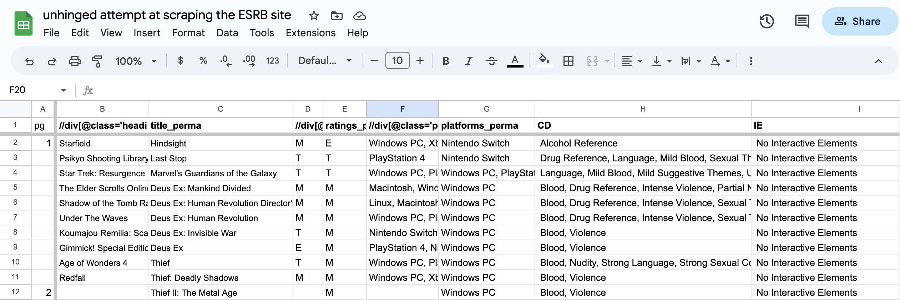

# J296 Final Project: Gaming the Rating: Gambling 

## Dear Data Diary

### 1. Sources

### Questions I want answered 

1. How many video games are labeled with gambling-related content descriptors ("Simulated Gambling", "Real Gambling", and "Gambling Themes)?
2. What are the ratings for video games with these descriptors, and what kinds of video games are these? How prevalent is the gambling for each descriptor? 
3. Are the gambling-related descriptors connected at all to the game's monetization strategy? Especially if it employs loot boxes, tagged as "In-Game Purchase (Includes Random Items)" in the ESRB's system.
4. How many games have the "In-Game Purchase (Includes Random Items)" interactive element tagline, and how does that compare to the more general "In-Game Purchase"?
5. Is the number or proportion of "In-Game Purchase (Includes Random Items)" games significant?

### 2. Gathering the data

No dataset like this existed publicly when I first began looking into this data. Two years ago, someone on Kaggle had created [a dataset of game ratings and content descriptors](https://www.kaggle.com/datasets/imohtn/video-games-rating-by-esrb) but this dataset had a few problems for my needs. For starters, two years worth in video game releases is a lot of data to be missing, and I wanted my dataset to be as up-to-date and inclusive as possible. The dataset I eventually used has 32,445 games, whereas the Kaggle dataset has 1,895 games. Now that I actually write out those numbers, it's very, very obvious that the Kaggle dataset isn't includive of all video games the ESRB has rated. 

A more nuanced issue with this dataset is that the "In-Game Purchases (Includes Random Items)" Interactive Element tagline only entered the ESRB's use in April 2020, [as per this press release](https://www.esrb.org/blog/in-game-purchases-includes-random-items/). A much larger problem is that, to my knowledge and according to the Kaggle description, there are no Interactive Elements in this dataset. It only accounts for content descriptors. 

This means I'll have to make my own dataset.

This is a list of the information I was hoping to get:
* Game Title
* Rating
* Platform(s)
* Content Descriptor(s)
    * Alcohol Reference
    * Animated Blood
    * Blood
    * Blood and Gore
    * Comic Mischief
    * Crude Humor
    * Drug Reference
    * Fantasy Violence
    * Gambling Themes
    * Intense Violence
    * Language
    * Lyrics
    * Mature Humor
    * Nudity
    * Partial Nudity
    * Real Gambling
    * Sexual Content
    * Sexual Themes
    * Sexual Violence
    * Simulated Gambling
    * Strong Language
    * Strong Lyrics
    * Strong Sexual Content
    * Suggestive Themes
    * Tobacco Reference
    * Use of Alcohol
    * Use of Drugs
    * Use of Tobacco
    * Violence
    * Violent Reference
* Interactive Element(s)
    * In-Game Purchases
    * In-Game Purchases (Includes Random Items)
    * Users Interact
    * Shares Location
    * Shares Info

#### 2.1 Brute forcing with Google Sheets

I started on the below Google Sheet, where I used the function "=IMPORTXML()" to pull game titles, ratings, platforms, content descriptions and interactive elements. I have not updated this since early April, which is why the `title_perma` column is different from the titles importing column. 

